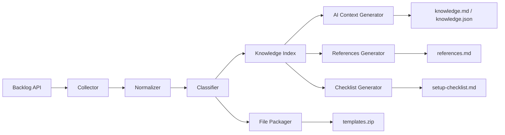
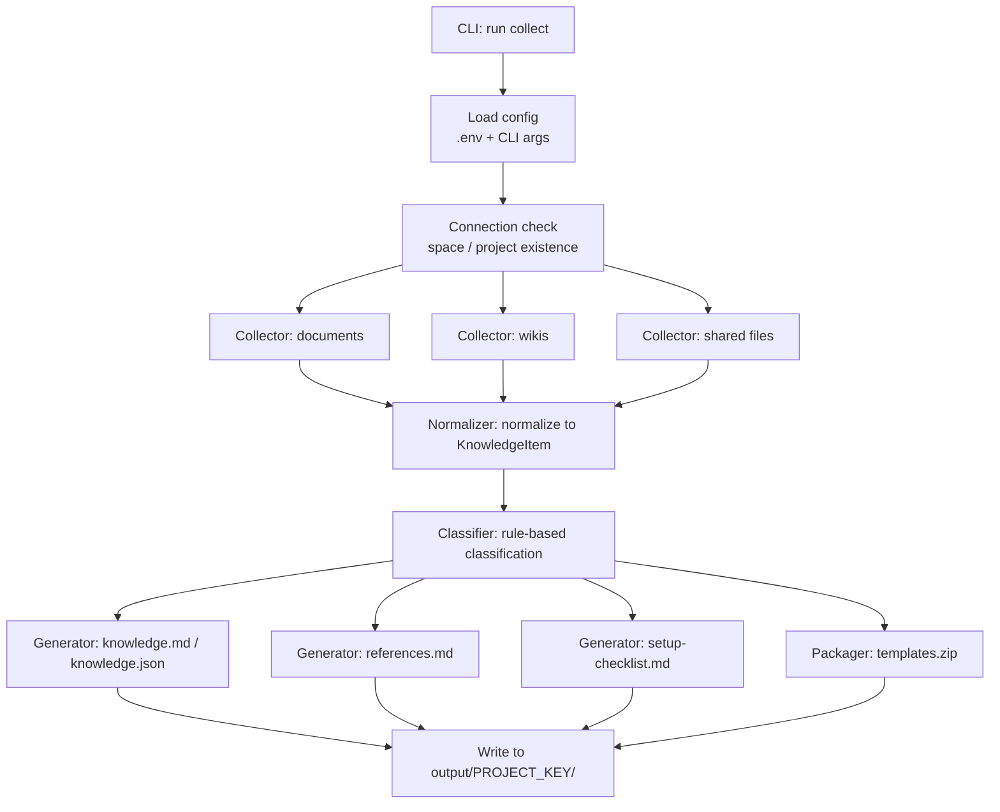

# Backlog Knowledge Packager — Basic Design

## Document Information

| Item | Content |
|------|---------|
| System name | Backlog Knowledge Packager |
| Document | Basic Design |
| Version | 0.1 (draft) |
| Created | 2026-07-02 |
| Status | Reviewed (2026-07-02) |
| Related | [Requirements Definition](./requirements.md) |

---

## 1. System Architecture



- The MVP (Phase 1) covers only the diagram above. Everything is **read → local output**; no write path to Backlog exists
- Phase 3 adds the "AI Update Assistant → proposal → human review → manual apply" line (§13 Future extensions)

---

## 2. Processing Flow (collect command)



Processing order:

1. **Load config** — read environment variables (`.env`), override with CLI arguments
2. **Connection check** — verify space/project existence and permissions (exit code 2 on failure)
3. **Collect** — fetch the types specified by `--targets` (with paging and rate-limit handling)
4. **Normalize** — unify all items into `KnowledgeItem` (§5.1); save contents/files under `files/`
5. **Classify** — classify into 7 categories by title/path keyword matching (§6)
6. **Generate** — write each output file and `metadata/`

---

## 3. Module Design

| Module | Responsibility | Input | Output |
|--------|----------------|-------|--------|
| **Collector** | Retrieval from the Backlog API only; endpoint knowledge concentrated here | Config (space / project / targets) | Raw responses (dict) + downloaded files |
| **Normalizer** | Normalize raw data into `KnowledgeItem`; Markdown conversion, URL attachment, encoding cleanup | Collector output | List of `KnowledgeItem` |
| **Classifier** | Rule-based classification (assign category) | `KnowledgeItem` | `KnowledgeItem` with category |
| **Generator** | Generate output files (knowledge / references / checklist) | Classified items | `.md` / `.json` files |
| **Packager** | Zip the collected files | `files/` + metadata | `templates.zip` |

### 3.1 Collector

- Project info / document list, contents, tree / wiki list, contents / shared file list, download / attachment download
- Paging (offset loop against the `count` limit; the POC lacks paging, so add it)
- Rate-limit handling (watch `X-RateLimit-*` headers; wait and retry on 429)
- Contain the impact of API spec changes within this layer (mitigation in Requirements §11)

### 3.2 Normalizer

- Convert document/wiki contents to Markdown (documents are Markdown-based and pass through mostly as-is; convert wiki notation as needed)
- Normalize titles (replace characters invalid in filenames) and encoding (unify to UTF-8)
- Attach source URL, created/updated timestamps, users, and type (this is where NFR-04 is enforced)

### 3.3 Classifier

- Keyword matching on titles and paths (§6.2)
- Content fallback classification, tags, matched keywords, and confidence scores are used for Phase 2 tuning without adding an external AI dependency

### 3.4 Generator

- Generate `knowledge.md` / `knowledge.json` / `references.md` / `setup-checklist.md` (§7)
- Always insert the source URL and last-updated date at the head of every item

### 3.5 Packager

- Bundle the files classified as `rule` / `template`, plus `references.md` / `setup-checklist.md` / `original-links.json`, into `templates.zip` (§7.5)

---

## 4. Backlog API Endpoints Used

Base URL: `https://{space}.{domain}` (`domain` is `backlog.com` / `backlog.jp` etc.; configurable — §8.2)

| Purpose | Endpoint | Status |
|---------|----------|--------|
| Space info (connection check) | `GET /api/v2/space` | Verify at implementation |
| Project info | `GET /api/v2/projects/:projectIdOrKey` | Verify at implementation |
| Document list | `GET /api/v2/documents?projectId[]=` | **Implemented in POC** |
| Document detail | `GET /api/v2/documents/:documentId` | **Implemented in POC** |
| Document tree | `GET /api/v2/documents/tree?projectIdOrKey=` | API reference confirmed; implementation pending |
| Document attachment DL | `GET /api/v2/documents/:documentId/attachments/:attachmentId` | API reference confirmed; implementation pending |
| Wiki list | `GET /api/v2/wikis?projectIdOrKey=` | Verify at implementation |
| Wiki detail | `GET /api/v2/wikis/:wikiId` | Verify at implementation |
| Wiki attachment list | `GET /api/v2/wikis/:wikiId/attachments` | API reference confirmed; implementation pending |
| Wiki attachment DL | `GET /api/v2/wikis/:wikiId/attachments/:attachmentId` | API reference confirmed; implementation pending |
| Shared file list | `GET /api/v2/projects/:projectIdOrKey/files/metadata/:path` | Verify at implementation |
| Shared file DL | `GET /api/v2/projects/:projectIdOrKey/files/:sharedFileId` | Verify at implementation |
| Rate limit info | `GET /api/v2/rateLimit` | API reference confirmed; optional diagnostic endpoint |
| Wiki update | `PATCH /api/v2/wikis/:wikiId` | Phase 4 `apply` only; separate write client |

> **Note**: Endpoints marked "API reference confirmed; implementation pending" are confirmed in the public Backlog API reference but are not fully collected by the current MVP implementation. The connection/retrieval pattern for the `GET /api/v2/documents` family is already implemented in the POC (`backlog-api-poc/document.py`).
>
> Authentication: attach the `apiKey` query parameter to every request (same as the POC). Write endpoints are outside the read-only collection table except for the Phase 4 Wiki-only `apply` endpoint above.

### 4.1 Source URL construction rules (draft)

| Type | URL format (draft) | Status |
|------|--------------------|--------|
| Document | `https://{space}.{domain}/document/{documentId}` | Needs verification |
| Wiki | `https://{space}.{domain}/alias/wiki/{wikiId}` | Needs verification |
| Shared file | `https://{space}.{domain}/file/{PROJECT_KEY}{path}` | Needs verification |

Confirm against actual page URLs (implementation task). If the API response contains a URL, prefer it.

---

## 5. Data Model

### 5.1 KnowledgeItem (central data structure)

The unified format representing one collected item. Defined as a dataclass in `models.py`.

```json
{
  "id": "document-01936f2a-xxxx",
  "sourceType": "document",
  "sourceId": "01936f2a-xxxx",
  "projectKey": "PROJECT_KEY",
  "title": "Coding conventions",
  "url": "https://{space}.{domain}/document/01936f2a-xxxx",
  "created": "2025-11-01T09:00:00+09:00",
  "createdUser": "yamada",
  "updated": "2026-06-20T10:00:00+09:00",
  "updatedUser": "suzuki",
  "category": "rule",
  "contentPath": "files/rules/coding-conventions.md"
}
```

| Field | Description |
|-------|-------------|
| `id` | Unique ID in `{sourceType}-{sourceId}` format |
| `sourceType` | `document` \| `wiki` \| `sharedFile` \| `attachment` |
| `url` | Reference URL on Backlog (**required** — NFR-04) |
| `category` | One of the 7 categories in §6.1 + `unclassified` |
| `contentPath` | Path of the content Markdown or downloaded file, relative to the output directory |

### 5.2 Files under metadata/

| File | Content |
|------|---------|
| `documents.json` | Raw responses of the Document API (list + details) |
| `wiki.json` | Raw responses of the Wiki API |
| `shared-files.json` | Raw responses of the shared-file API |
| `source-map.json` | Array of all `KnowledgeItem`s. **The output ⇔ Backlog URL mapping table** |

Raw responses are kept so output formats can be regenerated without re-fetching, and so field-level spec changes can be tracked.

---

## 6. Classification Design

### 6.1 Categories (7 + unclassified)

| Category | Examples |
|----------|----------|
| `rule` | Development conventions, naming rules, review conventions |
| `template` | Issue templates, design-doc templates, meeting-minutes templates |
| `setup` | Environment setup, initial configuration, local startup steps |
| `onboarding` | Materials for new members, team introduction, reading order |
| `knowledge` | Past knowledge, decision history, troubleshooting |
| `operation` | Operational procedures, release procedures, incident response |
| `reference` | External URLs, related materials, API specs |
| `unclassified` | Matches none of the above (implementation addition; folded into the knowledge section in outputs) |

### 6.2 Rule-based classification (MVP)

Keyword matching against titles (and file paths). **Evaluate top-down; the first match wins.**

| Order | Keywords (initial set) | Category |
|-------|------------------------|----------|
| 1 | テンプレート, template, 雛形, ひな形 | `template` |
| 2 | 環境構築, セットアップ, setup, インストール, 初期設定 | `setup` |
| 3 | 新人, オンボーディング, onboarding | `onboarding` |
| 4 | 規約, ルール, 規則, 命名 | `rule` |
| 5 | 手順, 運用, リリース, 障害 | `operation` |
| 6 | ナレッジ, トラブル, FAQ, Q&A | `knowledge` |
| 7 | 参考, 参照, リンク集, URL一覧 | `reference` |
| — | (no match) | `unclassified` |

- Because titles like「規約テンプレート」(convention template) match multiple categories, `template` is evaluated before `rule`
- The keyword table is a code constant (configuration file in the future) so it can be tuned during operation
- Phase 2 adds content fallback classification, tag extraction, matched keyword metadata, confidence scores, and `classification-summary.json` quality metrics plus source-linked `unclassifiedItems` / `lowConfidenceItems` diagnostics. External AI semantic classification remains a future extension if project data shows the local classifier is not enough.

---

## 7. Output Specification

### 7.1 Output directory structure

```text
output/
  PROJECT_KEY/
    knowledge.md          # Consolidated content for AI ingestion
    knowledge.json        # Structured data (KnowledgeItem array + contents)
    references.md         # Reference URL list for new members
    setup-checklist.md    # Environment-setup checklist
    onboarding.md         # (Phase 2)
    warnings.md           # Stale, duplicate, and broken-link warnings (Phase 2)
    templates.zip         # Bundle of templates and convention files
    files/
      rules/              # Contents/files classified as rule
      templates/          # Files classified as template
      attachments/        # Attachments
    metadata/
      documents.json
      wiki.json
      shared-files.json
      source-map.json
      classification-summary.json
      collection-summary.json
      partial-failures.json
```

### 7.2 Structure of knowledge.md

Contents are concatenated in category order (rule → setup → operation → knowledge → onboarding → reference → template list), and **the source and updated date are always inserted at the head of each item**.

```markdown
# PROJECT_KEY knowledge (auto-generated)

> Generated: 2026-07-02T10:00:00+09:00 / by Backlog Knowledge Packager
> Every item carries its source URL. Always check the source for the latest state.

## Conventions (rule)

### Coding conventions
- Source: https://... (last updated: 2026-06-20 / by suzuki)

(content)

## Environment setup (setup)
...
```

### 7.3 references.md (example output)

```markdown
# PROJECT_KEY reference documents

## Read first

1. Team development rules
   - Type: Document
   - URL: (Backlog URL)
   - Updated: 2026-06-20

2. Coding conventions
   - Type: Document
   - URL: (Backlog URL)
   - Updated: 2026-05-10

## Templates

1. Issue template
2. Design-doc template
3. Review-request template

## Past knowledge

1. Common environment-setup errors
2. Frequent review findings
```

In the MVP, the order of "Read first" is `rule` → `setup` → `onboarding` categories sorted by updated date descending (curated reading order is handled by onboarding.md in Phase 2).

### 7.4 setup-checklist.md (example output)

In the MVP, classified items are poured, with links, into a fixed section structure (conventions check / template placement / project-specific rules / reference URLs) (FR-14 basic). Content-analysis-driven item generation is Phase 2 (FR-18).

```markdown
# Environment-setup checklist

## 1. Check conventions
- [ ] Read the coding conventions — (URL)
- [ ] Read the branch policy — (URL)

## 2. Place templates
- [ ] Fetched the issue template — (URL)
- [ ] Fetched the design-doc template — (URL)

## 3. Project-specific rules
- [ ] Checked project-specific prohibitions — (URL)

## 4. Reference URLs
See references.md for details.
```

### 7.5 Internal structure of templates.zip

```text
project-package/
  README.md            # Pack description, generation time, source project
  references.md
  setup-checklist.md
  rules/
    coding-rule.md
    branch-rule.md
  templates/
    issue-template.md
    design-template.docx
  original-links.json  # Mapping of files in the zip ⇔ Backlog URLs (extract of source-map.json)
```

The zip can be handed to new members / new project members and expanded as-is (Core Principle 3).

---

## 8. CLI Specification

### 8.1 Command

```bash
backlog-packager collect \
  --space your-space \
  --project PROJECT_KEY \
  --targets documents,wiki,shared-files \
  --output ./output/PROJECT_KEY
```

| Argument | Required | Description | Default |
|----------|:--------:|-------------|---------|
| `--space` | — | Space key | Env var `BACKLOG_SPACE_KEY` |
| `--domain` | — | `backlog.com` / `backlog.jp` etc. | Env var `BACKLOG_DOMAIN`, else `backlog.com` |
| `--project` | — | Project key | Env var `BACKLOG_PROJECT_KEY` |
| `--targets` | — | Comma-separated set of `documents` / `wiki` / `shared-files` | all |
| `--output` | — | Output directory | `./output/{PROJECT_KEY}` |
| `--classification-rules` | — | Optional JSON file with project-specific classification category and tag keywords | none |
| `--skip-attachment-downloads` | — | List document/wiki attachment metadata without downloading attachment bodies | false |
| `--shared-file-path` | — | Shared-file directory path to collect recursively | `/` |

`verify-output` verifies generated packages before handoff or Phase 2 acceptance:

```bash
backlog-packager verify-output \
  --output ./output/PROJECT_KEY \
  --max-unclassified-rate 0.2 \
  --require-cache-skip \
  --require-no-partial-failures \
  --write-report
```

`--require-cache-skip` is intended for the second `collect` run during FR-15 acceptance.
`--require-no-partial-failures` is intended for final acceptance when every selected target must be collected without non-fatal failures.
`--write-report` writes `metadata/acceptance-report.md` so issue and PR evidence can be attached without manually copying every JSON field.
`--classification-rules` supports FR-16 tuning without adding an external AI dependency. The file is a JSON object with optional `categories` and `tags` objects:

```json
{
  "categories": {
    "rule": ["ADR", "architecture decision record"]
  },
  "tags": {
    "architecture": ["ADR", "decision record"]
  }
}
```

Custom category keywords are evaluated before built-in classifier keywords. Custom tag keywords are merged with built-in tags.
`suggest` is added in Phase 3+. `apply` is added in Phase 4 as a confirmed Wiki-only write flow.
See [`phase3_suggest_review.md`](./phase3_suggest_review.md) for the local-only operations checklist.
See [`phase4_apply_boundary.md`](./phase4_apply_boundary.md) for apply safeguards.

### 8.2 Environment variables (.env)

```bash
BACKLOG_SPACE_KEY=your-space
BACKLOG_API_KEY=xxxxxxxx        # Required. Read permission is sufficient
BACKLOG_PROJECT_KEY=PROJECT_KEY # Optional if --project is provided
BACKLOG_DOMAIN=backlog.com      # Optional. Set for backlog.jp spaces
```

> The POC hard-coded the base URL to `backlog.com`; the domain is made configurable to support `backlog.jp` spaces.

### 8.3 Exit codes

| Code | Meaning |
|:----:|---------|
| 0 | Success |
| 1 | Configuration error (missing env vars, invalid arguments) |
| 2 | API error (auth failure, project not found, retry limit exceeded) |
| 3 | Partial failure (some items failed to fetch but outputs were generated; failures listed in the log) |

---

## 9. Safety Design (Structural Enforcement of Read-Only)

Requirement FR-11 "read-only" is enforced **by code structure, not by convention**.

### 9.1 ReadOnlyBacklogClient

```python
class ReadOnlyBacklogClient:
    """GET-only Backlog API client.

    post / put / patch / delete are not defined.
    By not even having the means to call write endpoints, the requirement
    "never update Backlog without permission" (FR-11) is enforced structurally.
    """

    def get(self, endpoint: str, params: dict | None = None) -> dict: ...
    def download(self, endpoint: str, dest: Path, params: dict | None = None) -> Path: ...
```

- The `post` / `delete` methods of the POC (`backlog-api-poc/client.py`) are **not ported**
- Phase 4 `apply` uses `ExplicitBacklogWriteClient` in a separate module and cannot instantiate it without explicit write configuration

### 9.2 Other safety measures

| Measure | Description |
|---------|-------------|
| Secret management | Register `.env` and `output/` in `.gitignore` (prevent committing API keys / internal info — NFR-01) |
| Log masking | Never log `apiKey` in logs/error messages (mask query strings when logging URLs) |
| Suggest isolation | Phase 3 AI proposals are file outputs to the local `suggestions/` directory only |
| Apply isolation | Phase 4 apply reads only approved local review files, supports Wiki only, checks `updated` before writing, and keeps audit logs local |
| Permissions | Follow Backlog-side permission settings. Issue the API key from a member with the minimum permissions needed for reading (NFR-02) |

---

## 10. Implementation Directory Layout (proposed)

Create the new project `backlog-knowledge-packager/` alongside the existing `backlog-api-poc/`.

```text
backlog-knowledge-packager/
├── pyproject.toml            # Managed by uv (Python 3.12+ / requests / python-dotenv)
├── .env.example              # BACKLOG_SPACE_KEY / BACKLOG_API_KEY / BACKLOG_PROJECT_KEY / BACKLOG_DOMAIN
├── .gitignore                # .env, output/, __pycache__, etc.
├── README.md                 # Usage and setup instructions
├── src/
│   └── backlog_packager/
│       ├── __init__.py
│       ├── cli.py            # argparse entry point (collect command)
│       ├── config.py         # Merge env vars and CLI args (§8)
│       ├── client.py         # ReadOnlyBacklogClient (GET / download only — §9.1)
│       ├── models.py         # Dataclasses such as KnowledgeItem (§5.1)
│       ├── collector/
│       │   ├── __init__.py
│       │   ├── documents.py  # Document list/contents/tree/attachments (§4)
│       │   ├── wikis.py      # Wiki list/contents/attachments
│       │   └── shared_files.py  # Shared file list/DL
│       ├── normalizer.py     # Normalization to KnowledgeItem, Markdown conversion (§3.2)
│       ├── classifier.py     # Rule/content-fallback classification and tags (§6)
│       ├── sync.py           # Source-map cache and differential sync helpers (FR-15)
│       ├── verify.py         # Generated package verifier for acceptance checks
│       └── generator/
│           ├── __init__.py
│           ├── common.py     # Shared Markdown helpers
│           ├── knowledge.py  # knowledge.md / knowledge.json (§7.2)
│           ├── references.py # references.md (§7.3)
│           ├── checklist.py  # setup-checklist.md (§7.4; content-derived tasks in Phase 2)
│           ├── onboarding.py # onboarding.md (FR-17)
│           ├── warnings.py   # stale/duplicate/broken-link warnings (FR-19/FR-20)
│           └── packager.py   # templates.zip (§7.5)
├── tests/
│   └── test_*.py             # Unit and CLI tests runnable without a real Backlog API key
└── output/                   # Generated artifacts (not tracked by git)
```

Design points:

- **API knowledge is concentrated in collector/** — contains the blast radius of Backlog API spec changes
- **classifier / generator are API-independent** — they take only `KnowledgeItem` as input, so unit tests need no API access
- **For Phase 3**, add a `suggester/` module (minimal changes to existing modules)

---

## 11. Relationship to the Existing POC

| POC (`backlog-api-poc/`) | Treatment in the new implementation |
|--------------------------|-------------------------------------|
| dotenv + `requests.Session` + `apiKey` query pattern in `client.py` | **Inherited**, but reduced to GET / download only (§9.1) |
| `post` / `delete` methods in `client.py` | Not ported (read-only enforcement) |
| Write API calls | Phase 4 Wiki apply uses `write_client.py`; write methods are not added to `client.py` |
| Base URL fixed to `backlog.com` | Made configurable via `BACKLOG_DOMAIN` (§8.2) |
| `list_documents` / `get_document` in `document.py` | Extended with paging loops into `collector/documents.py` |
| `create_document` in `document.py` | Not ported (write operation) |
| `main.py` (smoke-test script) | Replaced by `cli.py` + connection check |
| The POC folder itself | Kept as-is for reference (do not modify) |

---

## 12. Technology Stack

| Item | Choice | Reason |
|------|--------|--------|
| Language | Python 3.12+ | Follows the POC |
| Package management | uv | Follows the POC |
| HTTP | requests | Follows the POC; sufficient for the purpose |
| Config | python-dotenv | Follows the POC |
| CLI | argparse (stdlib) | Minimal dependencies (NFR-07) |
| Zip | zipfile (stdlib) | Minimal dependencies |
| Testing | pytest | Unit tests for classification/normalization logic |

---

## 13. Future Extensions (Phase 2–4 design policy)

### 13.1 suggest mode (Phase 3)

Generate a full set of update proposals locally, without writing to Backlog.

```text
suggestions/
  document-1234.update.md   # Full proposed text after update
  document-1234.diff.md     # Diff and rationale
  document-1234.review.json # Review state (pending / approved / rejected)
```

Format of `*.diff.md` (example):

````markdown
# Update proposal: Coding conventions

## Target
- Type: Document
- Backlog URL: (URL)
- Last updated: 2026-05-10

## AI proposal
### Content that should be added
- TypeScript naming rules
- Mapping to the ESLint configuration

## Diff
```diff
+ Function names start with a verb
+ Boolean variables use is / has / can prefixes
```

## Note
This content has NOT been applied to Backlog.
Apply it only after human review.
````

### 13.2 Stale / duplicate detection (Phase 2)

Detect the following and output as `warnings.md` (or a `warnings` array inside `knowledge.json`):

- Conventions whose last update is more than 1 year old
- Multiple templates with the same name
- Same-name pages existing in both Wiki and Documents
- Titles containing words like「旧」"old" "deprecated"「廃止」
- Broken reference URLs

### 13.3 apply mode (Phase 4)

- The writing client is a **separate module** from `ReadOnlyBacklogClient`
- Only items whose `*.review.json` status is `approved` are planned or applied
- Dry-run is the default; real writes require `--confirm-apply` and `BACKLOG_ENABLE_WRITE=1`
- Phase 4 automatic apply supports Wiki pages only. Documents, shared files, and attachments are rejected for automatic apply.
- Before any write, the command fetches current Wiki metadata and rejects the batch if any reviewed `updated` timestamp is stale.
- Webhook sync, Web UI / chatbot, and permission-aware RAG remain external operational extensions; the standard package stays CLI-only and dependency-light.
- See [`phase4_apply_boundary.md`](./phase4_apply_boundary.md) for apply safeguards.
- See [`phase4_operational_decisions.md`](./phase4_operational_decisions.md) for Phase 4 decisions covering FR-24 through FR-28.

---

## 14. References

- [Requirements Definition](./requirements.md)
- [Backlog API reference (Nulab Developer)](https://developer.nulab.com/ja/docs/backlog/)
- Existing POC: [`../backlog-api-poc/`](../backlog-api-poc/)
