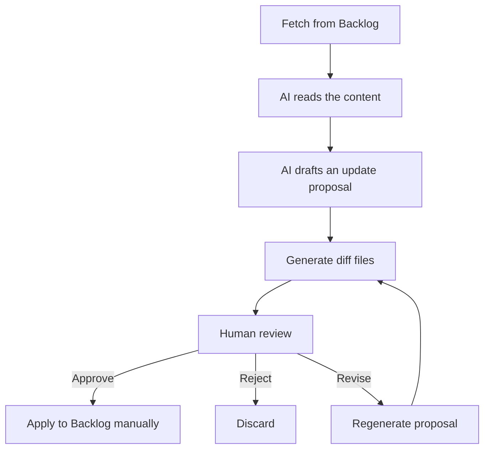

# Backlog Knowledge Packager — Requirements Definition

## Document Information

| Item | Content |
|------|---------|
| System name | Backlog Knowledge Packager |
| Document | Requirements Definition |
| Version | 0.1 (draft) |
| Created | 2026-07-02 |
| Status | Reviewed (2026-07-02) |
| Related | [Basic Design](./design.md) |

---

## 1. Background and Problems

Backlog is used as the center of project and knowledge management, but the following problems exist.

### 1.1 High cost of referencing documents

- The hierarchy is deep and finding the right information takes time
- Only people who already know the location can navigate there (person-dependent)
- Feeding content to an AI requires manual copy & paste from the browser every time

### 1.2 Information is scattered

- Development conventions exist in multiple places
- Templates are scattered across projects
- Past knowledge is hard to discover
- Some information cannot be reached without knowing its URL

### 1.3 Onboarding new members takes time

- The location of team rules is unclear
- There are many documents to read, with no defined reading order
- Sharing past knowledge depends on specific individuals

### 1.4 Environment setup is manual

- Convention files and templates are collected by hand
- Required materials differ per project
- Zipping and handing over the files is itself a chore

---

## 2. Purpose

The purpose of this system in one sentence:

> **Collect conventions, templates, past knowledge, and reference URLs per project from Backlog documents, wikis, shared files, and attachments in a read-only manner, and automatically generate AI-readable Markdown, a reference list for new members, an environment-setup checklist, and a template zip. The AI never updates Backlog directly; it is limited to generating update proposals for human review.**

This system is not merely "a tool that fetches files from Backlog" — it is **a mechanism that restructures scattered knowledge into a form usable for AI, onboarding, and environment setup**.

---

## 3. Core Principles (Four Pillars)

| # | Principle | Description |
|---|-----------|-------------|
| 1 | Reduce the cost of finding information | List document structures and reference URLs, and restructure them into a form easy to hand to both AI and new members |
| 2 | Aggregate while preserving sources | Do not move original data; build an aggregated view (index) that keeps source URLs |
| 3 | Make templates and conventions distributable | Collect the actual files and generate a package that can be expanded as-is (zip) |
| 4 | Let AI propose updates, never apply them | The AI's role ends at generating proposals and diffs. Applying changes requires human approval (Human in the Loop) |

Principle 4 (**no unauthorized updates**) is the core requirement of this system and takes precedence over every functional requirement and design decision.

---

## 4. Scope

### 4.1 Information sources in scope

| Source | Position | Notes |
|--------|----------|-------|
| Documents | **Primary target** | Source of conventions, procedures, knowledge, and reference URL lists |
| Wiki | Secondary target | Existing wikis only, for reference during migration (see §10.3) |
| Shared files | In scope | Templates, convention files, configuration samples |
| Attachments | In scope | Document and wiki attachments (issue attachments as needed) |
| Issues / comments | Future consideration | Source of past decisions and Q&A; considered in Phase 2+ |

### 4.2 Out of scope (not implemented under these requirements)

- Automatic writes to Backlog (only "apply after approval" is considered in Phase 4)
- Web admin UI
- Chatbot integration (Slack / Teams, etc.)
- RAG search using a vector DB

---

## 5. Functional Requirements

### 5.1 Priority: High (required for MVP)

| ID | Requirement | Description |
|----|-------------|-------------|
| FR-01 | API connection | Connect with a Backlog API key (OAuth 2.0 is a future consideration) |
| FR-02 | Project selection | Target project can be specified by project key |
| FR-03 | Document retrieval | Retrieve document list, contents, and tree |
| FR-04 | Wiki retrieval | Retrieve list and contents of existing wikis |
| FR-05 | Shared file retrieval | List and download templates and convention files |
| FR-06 | Attachment retrieval | Retrieve document and wiki attachments |
| FR-07 | URL preservation | Keep the Backlog reference URL on every retrieved item |
| FR-08 | Metadata preservation | Store title, type, updated time, author, and project |
| FR-09 | Markdown output | Generate `knowledge.md` that is easy for an AI to ingest |
| FR-10 | JSON index output | Generate `knowledge.json` / `metadata/` for programmatic processing |
| FR-11 | **Read-only** | Never call any write API against Backlog |
| FR-12 | Zip creation | Generate `templates.zip` bundling templates and convention files |
| FR-13 | Reference list generation | Generate `references.md` (reference URL list) for new members |
| FR-14 | Checklist generation (basic) | Generate `setup-checklist.md` based on classification results |

> **Note**: The concept-stage priority table placed "onboarding material generation" and "setup checklist" at medium priority, but since the recommended MVP (§8) includes `references.md` / `setup-checklist.md` in its outputs, **basic generation was promoted to high priority (FR-13 / FR-14)**. Advanced generation based on content analysis (including `onboarding.md`) is positioned in Phase 2 as FR-17 / FR-18.

### 5.2 Priority: Medium (post-MVP / Phase 2–3)

| ID | Requirement | Description | Phase |
|----|-------------|-------------|-------|
| FR-15 | Differential sync | Re-fetch only updated documents | Phase 2 |
| FR-16 | Advanced classification | Improve rule-based classification accuracy, AI semantic classification, tagging | Phase 2 |
| FR-17 | Onboarding material generation | `onboarding.md` (team rules, reading order, past-knowledge summary) | Phase 2 |
| FR-18 | Checklist generation (content-derived) | Build `setup-checklist.md` automatically by analyzing conventions and procedures | Phase 2 |
| FR-19 | Stale information detection | Warn about conventions/templates with old updated timestamps (see §11) | Phase 2 |
| FR-20 | Duplicate detection | Detect and warn about same-name / similar templates | Phase 2 |
| FR-21 | AI update proposal generation | Generate update-proposal files locally without updating Backlog | Phase 3 |
| FR-22 | Diff display | Generate before/after diff files | Phase 3 |

### 5.3 Priority: Low (deferred / Phase 4+)

| ID | Requirement | Description |
|----|-------------|-------------|
| FR-23 | Automated Backlog update | Apply only human-approved changes via the API |
| FR-24 | Web UI | Choose target projects and outputs from an admin screen |
| FR-25 | Chatbot | Ask questions from Slack / Teams |
| FR-26 | Webhook sync | Re-sync automatically when Backlog is updated |
| FR-27 | Permission-aware AI answers | Restrict answer scope based on user permissions |
| FR-28 | Full RAG adoption | Cross-project search using a vector DB |

---

## 6. Non-Functional Requirements

| ID | Category | Requirement |
|----|----------|-------------|
| NFR-01 | Security | Manage the API key via environment variables (`.env`); never include it in code, outputs, or logs |
| NFR-02 | Security | Never access projects outside the executing user's API-key permissions (access control follows Backlog-side permission settings) |
| NFR-03 | Security | The scope of information passed to external AI services must be controllable (explicit selection of target projects and types) |
| NFR-04 | Traceability | Attach the source URL and last-updated timestamp to every output. **Information without a source URL must not be output** |
| NFR-05 | Execution | Runs as a CLI. Manual execution and scheduled execution (task scheduler, etc.) are assumed |
| NFR-06 | API usage | Respect Backlog API rate limits (monitor response headers, retry) |
| NFR-07 | Maintainability | Keep dependencies minimal (around requests / python-dotenv) |

---

## 7. Mode Definitions

System behavior is separated into the following five modes, structurally distinguishing whether Backlog is written to.

| Mode | Role | Writes to Backlog | Phase |
|------|------|:-----------------:|-------|
| `read` | Retrieve information, build indexes, create AI-ready data | No | **MVP** |
| `package` | Download templates, create zip | No | **MVP** |
| `suggest` | AI generates update proposals and diffs locally | No | Phase 3 |
| `review` | Humans review the proposals | No | Phase 3 |
| `apply` | Apply only approved changes | **Yes** | Phase 4 (not implemented for now) |

### Update flow (Human in the Loop)



Through MVP–Phase 3, the flow ends at "F: apply to Backlog manually". Automated application via the API (`apply` mode) is considered in Phase 4 only after operations are established.

---

## 8. Phase Plan

| Phase | Content | Modes |
|-------|---------|-------|
| **Phase 1 (MVP)** | Read-only. Retrieve documents / wiki / shared files / attachments, output Markdown & JSON, `references.md`, `setup-checklist.md` (basic), `templates.zip` | read + package |
| **Phase 2** | Differential sync, advanced classification, `onboarding.md`, content-derived checklist, stale/duplicate detection | read + package |
| **Phase 3** | AI update proposals, diff display, human review | + suggest / review |
| **Phase 4** | Apply after approval, webhook sync, permission-aware search | + apply |

### MVP (v0.1) definition

```text
Backlog Knowledge Packager v0.1

Purpose:
  Collect reference materials, conventions, templates, and knowledge of a
  given project, and bundle them in a form that can be handed to AI and
  new members.

Targets:
  - Backlog documents
  - Existing wikis
  - Shared files
  - Attachments

Outputs:
  - references.md
  - knowledge.md
  - knowledge.json
  - setup-checklist.md
  - templates.zip
  - metadata/ (documents.json / wiki.json / shared-files.json / source-map.json)

Constraints:
  - Writing to Backlog is prohibited
  - AI generates proposals only (Phase 3+)
  - Every piece of information carries its source URL
  - The API key is managed via environment variables
```

> **First goal**: automatically generate, from the Backlog API, a "project material pack" to hand to new members and AI.

---

## 9. Deliverables (Output Files)

| File | Role | Phase |
|------|------|-------|
| `knowledge.md` | Consolidated content for AI ingestion | MVP |
| `knowledge.json` | Structured data for programmatic processing | MVP |
| `references.md` | Reference URL list for new members | MVP |
| `setup-checklist.md` | Checklist to run during environment setup | MVP (basic) |
| `templates.zip` | Per-project bundle of templates and convention files | MVP |
| `metadata/source-map.json` | Records which output came from which Backlog URL | MVP |
| `onboarding.md` | Team rules, reading order, past-knowledge summary | Phase 2 |
| `suggestions/*.diff.md` etc. | AI update proposals, diffs, review files | Phase 3 |

---

## 10. Constraints

### 10.1 Read-only (most important)

- Through MVP–Phase 3, **never call any Backlog write API** (create / update / delete)
- The client implementation must not even have write methods, enforcing this structurally (see [Basic Design §9](./design.md#9-safety-design-structural-enforcement-of-read-only))

### 10.2 Source URLs are mandatory

Because AI-generated summaries alone lose track of where information came from, every output keeps the following metadata so readers can always return to the original Backlog page.

```json
{
  "sourceType": "document",
  "projectKey": "PROJECT_KEY",
  "title": "Coding conventions",
  "url": "(URL on Backlog)",
  "updated": "2026-06-20T10:00:00+09:00",
  "createdUser": "xxx",
  "category": "rule"
}
```

### 10.3 Do not depend on Wiki

Backlog has announced a policy of consolidating knowledge management into the Document feature: **from July 14, 2026, new spaces will not have the Wiki feature, and Wiki will be off by default for new projects in existing spaces**. Wikis in existing spaces/projects remain usable for now, but future integration of Wiki into Documents has also been announced.

- Source: [新規スペースへのWiki提供終了と初期設定の変更について (Backlog Blog)](https://backlog.com/ja/blog/backlog-update-wiki-end-of-support-new-spaces/)
- Source: [ドキュメント機能の正式リリースとWikiからの移行機能提供のお知らせ (Backlog Blog)](https://backlog.com/ja/blog/backlog-update-document-202512/)

Therefore this system is designed with the following positioning:

```text
Primary:   Documents
Secondary: Existing wikis (reference during migration)
Files:     Shared files and attachments
```

### 10.4 Prevent distributing wrong information

- Do not treat old conventions as current (addressed by FR-19: stale detection)
- Never answer without a source URL (NFR-04)
- Avoid ungrounded AI answers (embed sources into `knowledge.md`)

---

## 11. Risks and Mitigations

| Risk | Impact | Mitigation |
|------|--------|------------|
| Stale conventions/templates mixed in | Wrong conventions distributed to new members / AI | Warn when last update is over 1 year old; detect words like「旧」"old" "deprecated"「廃止」(FR-19) |
| Duplicate same-name / similar templates | Unclear which is authoritative | Warn via duplicate detection (FR-20), including same-name pages across Wiki and Documents |
| Broken reference URLs | Cannot reach the source | Broken-link detection (Phase 2) |
| Backlog API spec changes | Retrieval stops working | Concentrate API calls in the Collector layer to limit blast radius (Design §3) |
| Wiki integration / retirement | Wiki collection becomes impossible | Documents are the primary target; Wiki is secondary (§10.3) |
| API key leakage | Unauthorized access to the space | `.env` management, gitignore, never included in outputs (NFR-01) |

---

## 12. Glossary

| Term | Definition |
|------|-----------|
| Document | A page managed by Backlog's Document feature; successor to Wiki for knowledge management |
| Wiki | Backlog's legacy knowledge feature. Not provided for new spaces from 2026-07-14 (§10.3) |
| Shared file | A file managed by the File feature of a Backlog project |
| KnowledgeItem | One unit of information collected and classified by this system (Design §5) |
| Project material pack | The output set: `references.md` / `knowledge.md` / `templates.zip`, etc. |
| Human in the Loop | An operating model where humans approve AI output before it is applied |

---

## 13. Open Issues

| # | Item | Current assumption |
|---|------|--------------------|
| 1 | Concrete target project (key) | TBD. Validate with one project in the MVP |
| 2 | Authentication method | API key (tied to an individual). Reconsider OAuth 2.0 for org-wide rollout |
| 3 | Execution frequency | Start with manual runs; scheduled runs as needed |
| 4 | Scope of information passed to external AI | Only the explicitly selected projects/types |
| 5 | Output storage location | Local folder; a Git-managed folder is also acceptable |
| 6 | Verify document-tree API and URL formats | Confirm on developer.nulab.com when implementation starts (Design §4) |

---

## 14. References

- [Backlog API overview (Nulab Developer)](https://developer.nulab.com/ja/docs/backlog/)
- [新規スペースへのWiki提供終了と初期設定の変更について (Backlog Blog)](https://backlog.com/ja/blog/backlog-update-wiki-end-of-support-new-spaces/)
- [ドキュメント機能の正式リリースとWikiからの移行機能提供のお知らせ (Backlog Blog)](https://backlog.com/ja/blog/backlog-update-document-202512/)
- Existing POC: [`../backlog-api-poc/`](../backlog-api-poc/) — verification code for Document API connection/retrieval patterns
